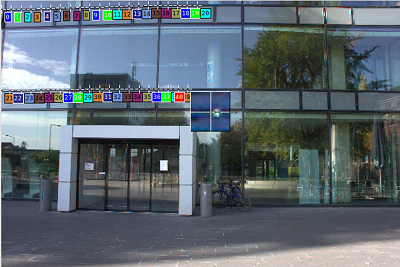
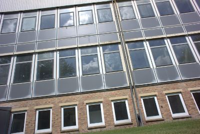
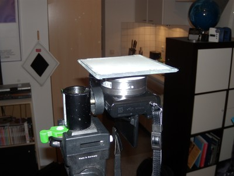

.. -*- mode: rst; coding: utf-8; ispell-local-dictionary: "british"; -*-
..
..   lens_calibration_tutorial.rst
..
..   Copyright © 2012–2016 Torsten Bronger <bronger@physik.rwth-aachen.de>,
..
..   This document is in the public domain.
..

======================================
Lens calibration for Lensfun
======================================

:Date: 2015/11/04
:Author: Torsten Bronger <bronger@physik.rwth-aachen.de>

.. note:: Contact me via mail at bronger@physik.rwth-aachen.de or via
   Jabber/XMPP/GoogleTalk at torsten.bronger@jabber.rwth-aachen.de if you have
   questions, suggestions, or problems concerning this tutorial.

.. contents::

The big picture
====================

All photographic lenses have different types of errors.  Three of them can be
corrected by software almost losslessly: `distortion`_, `transverse chromatic
aberration`_, and `vignetting`_.  The `Lensfun`_ library provides code to do
these corrections.  Lensfun is not used by the photographer directly.  Instead,
it is used by software such as Darktable, Rawstudio, UFRaw, digiKam,
ImageMagick, and others.  For example, you import a RAW into Darktable,
Darktable detects the lens, focal length, and *f* number used for this
photograph, and it then calls Lensfun to automatically rectify the photograph.
Great, isn’t it?

.. _`Lensfun`: http://lensfun.sourceforge.net/
.. _`distortion`: http://en.wikipedia.org/wiki/Distortion_(optics)
.. _`transverse chromatic aberration`: http://en.wikipedia.org/wiki/Chromatic_aberration
.. _`vignetting`: http://en.wikipedia.org/wiki/Vignetting

Lensfun uses a database to know all the parameters needed to do the lens
corrections.  This database is filled by photographers like you, who took time
to calibrate their lenses and to submit their findings back to the Lensfun
project.  If you’re lucky, your lens models are already included.  If not,
please use this manual to do the calibration and contribute your results.  You
help yourself and others.

Okay, let us assume your lens model isn’t yet covered by Lensfun, or not good
enough.  The following sections show you how to create an entry of your own.
Note that you needn’t do all of this.  Do whatever your spare time allows.
Lensfun is very flexible.

.. note:: I set up a `lens calibration service`_.  If you don’t want or cannot
   do the calibration but at least can take the calibration pictures, upload
   them there.

.. _`lens calibration service`: http://wilson.bronger.org/calibration

Preparations
================

The following procedure is tested on Ubuntu.  However, it should work on any
system where `Python3`_, `Numpy + SciPy`_, `ImageMagick`_, `dcraw`_, `Hugin`_,
and `exiftool`_ are properly installed.

.. _`Python3`: http://www.python.org/getit/
.. _`Numpy + SciPy`: http://www.scipy.org/Installing_SciPy
.. _`ImageMagick`: http://www.imagemagick.org/script/binary-releases.php
.. _`dcraw`: http://www.cybercom.net/~dcoffin/dcraw/
.. _`Hugin`: http://hugin.sourceforge.net/download/
.. _`exiftool`: http://www.sno.phy.queensu.ca/~phil/exiftool/install.html

Download the Python script `calibrate.py`_.  It takes a bunch of photographs
plus a control text file and creates the Lensfun data entries automatically.

.. _`calibrate.py`: http://wilson.bronger.org/lens_calibration_tutorial/calibrate.py

Create a directory where your calibration files should reside.  Eventually, it
will have the following structure::

    root directory
	 |
	 +---> lenses.txt
	 |
	 +---> distortion
	 |       \
	 |        `--> a lot of RAWs
	 |
	 +---> tca
	 |       \
	 |        `--> a lot of RAWs
	 |
	 +---> vignetting
		 \
		  `--> a lot of RAWs

The file ``lenses.txt`` lists all lenses of your calibration session.  It may
look like this::

    E 16mm F2.8: Sony, Sony E, 1.5
    distortion(16mm) = 0.01701, -0.02563, -0.0052

    E 18-55mm F3.5-5.6 OSS: Sony, Sony E, 1.5
    distortion(18mm) = 0.02897, -0.08920, 0.03513
    distortion(19mm) = 0.05477, -0.18267, 0.1583
    distortion(20mm) = 0.02164, -0.05738, 0.01945
    distortion(24mm) = 0.01405, -0.02629, 0.00229
    distortion(30mm) = 0.01175, -0.02135, 0.02549
    distortion(35mm) = 0.00822, -0.00590, 0.00973
    distortion(55mm) = 0.00220, -0.00232, 0.01446

Every lens entry begins with a line

::

    <lens name>: <maker>, <mount>, <cropfactor>, <type>

“lens name” and “maker” must match *exactly* the spelling in the EXIF data.
“type” is “fisheye” for fisheye lenses and is omitted otherwise.

Normally, you don’t have to type everything in ``lenses.txt`` yourself, see the
section “Distortion”.

EXIF trouble
------------

If your RAWs don’t contain their proper lens model name, focal length, and/or
aperture in their EXIF data, you can put it in the file name instead.  For
example, you may rename to

::

    Canon_EF_24-70mm_f__2.8L_USM--35mm--2.8.CR2

In the lens name, the following substituions apply, since some characters that
occur in lens names are not allowed in (Hugin) filenames:

===========================  ===============================
substitute                   original character in lens name
===========================  ===============================
``_`` (single underscore)    “ ” (space)
``__`` (double underscore)   ``/``
``___`` (triple underscore)  ``:``
``##``                       ``=``
``++``                       ``*``
===========================  ===============================

Distortion
=============

   Measuring lens distortion with Hugin.

.. [Taken from the `Hugin tutorial for lens calibration`_ and `PTlens target hints`_.]

.. _`Hugin tutorial for lens calibration`: http://hugin.sourceforge.net/tutorials/calibration/en.shtml
.. _`PTlens target hints`: http://epaperpress.com/ptlens/calTargets.html

First, have a look at the `screencast at Vimeo`_.  It gives you an overview.
Additionally, it demonstrates how to do the actual calibration with the `Hugin
panorama stitcher`_.  Unfortunately, the video refers to an older version of
Hugin.  Since 2014, Hugin uses a different user interface.  If you know Hugin,
you probably are able to map the workfow to the new UI.

.. _`screencast at Vimeo`: https://vimeo.com/51999287
.. _`Hugin panorama stitcher`: http://hugin.sourceforge.net/

Take the test photographs [#]_.  Put the RAWs in the directory ``distortion/``.
If you don’t have a ``lenses.txt`` yet, call ``calibrate.py`` from the root
directory.  It will generate a template ``lenses.txt`` file, plus TIFFs from
all RAW files in ``distortion/`` ready-to-be-used for Hugin.  Complete the lens
lines in ``lenses.txt``.

Now use Hugin to do the calibration as shown in the screencast, and
copy-and-paste the resulting values for (a), (b), and (c) into ``lenses.txt``.

Repeat this for every lens.  For zoom lenses, repeat this for every focal
length that you calibrate.

.. 
   note:: You may have heard about the Hugin `Calibrate lens gui`_.  I don’t
   recommend it.  If you need to detect border-to-border straight lines in one
   piece, this tool works unreliably.  It may become useful in a future version
   if it allows for manual control points.

.. _`Calibrate lens gui`: http://hugin.sourceforge.net/docs/manual/Calibrate_lens_gui.html

Chromatic aberration (TCA)
====================================

   Good example of an object for TCA calibration.

.. [Taken from the `Lensfun homepage`_.]

.. _`Lensfun homepage`: http://lensfun.sourceforge.net/lens-calibration/lens-tca.html

Look for a large object with sharp high-contrast edges throughout the
image. Preferably, the edges should be black–white but anything close to that
is sufficient.  Assure that there are such edges in the corners, too.  In many
cases, you can use the very same pictures for distortion and chromatic
aberration correction, but TCA doesn’t need the straight lines.

You should take your pictures being at least 8 metres away.  For zoom lenses,
take pictures at the same focal lengths as for distortion.  Take really sharp
pictures.

Put the RAWs in the directory ``tca/``.

Vignetting
==============

   Example setup for vignetting measurement.

Never use a monitor for vignetting measurements!

You need a diffuser in front of the lens.  This may be translucent milk glass,
or white plastic foil.  Whatever, as long as it is opaque enough so that
nothing can be seen through it, yet transparent enough so that light can pass
through it.  It must not be thicker than 3 mm.  It shouldn’t have a noticeable
texture.  It must be perfectly flush with the lens front, and it mustn’t be
bent.  It must be illuminated *homogeneously*.

As an example, my own diffuser was white plastic foil taped on a piece of
ordinary glass for stability.  I illuminated the ceiling of my room with an
uplight, pointed the camera upwards and put the foil without a gap on the lens.
Then I took the pictures.

Switch your camera to RAW mode.  Make sure that no corrections are applied by
the camera (some models do this even for RAWs).  Set the camera to “aperture
priority” and the lowest ISO.  Switch on manual focus.

Focus at infinity.  (Despite the foil directly in front of the lens.)  Take
pictures at maximal aperture and at three smaller apertures in 1 stop distance,
and at the minimal aperature.  For zoom lenses, take pictures at five focal
lengths.  This makes 5 pictures for primes and 25 for zooms.

Put the pictures in ``vignetting/``.

Vignetting correction for the *really* diligent
-----------------------------------------------

(I don’t recommend doing the following because the gain in accuracy is really
very small for the lenses I’ve seen so far.)

Lensfun can correct vignetting depending on distance.  Thus, you can achieve a
*little* bit more accuracy by shooting at different distances.  Additionally to
focus at infinity, repeat the procedure with focus at the near point [#]_.
Further senseful distances are near point times 6 and near point times 2, in
this order.  This means up to four different distances.  But again: This is not
necessary.  If it sounds too tedious to you, shooting at infinity is
sufficient.

Put pictures for distances other than infinity in ``vignetting_<distance>/``.
For example, pictures for 20 cm belong in ``vignetting_0.2/``.

For every focal length/aperture/distance triplett, you can take more than one
picture, possibly with moving the foil a bit or with tilting the camera a
bit. ``calibrate.py`` will detect such equivalent pictures, and will take the
average.

Bringing it together
==========================

Now, call ``calibrate.py`` from the root directory.  Wait.  For a long time.

The result is a ``lensfun.xml`` file.  Install it locally according to `How
database files are found and loaded`_.  Check that there is also an entry for
your camera and lens mount.  The `Lensfun manual`_ shows an example file.

.. _`How database files are found and loaded`: http://lensfun.sourceforge.net/manual/dbsearch.html
.. _`Lensfun manual`: http://lensfun.sourceforge.net/manual/dbformat.html

.. important:: Send your ``lensfun.xml`` to one of the `Lensfun maintainers`_!
    Thank you!

.. _`Lensfun maintainers`: http://lensfun.sourceforge.net/calibration/

.. [#] If you cannot get a picture of a building in your vicinity, don’t worry.
       Most lenses don’t need the full 8 metres of distance.  What really
       matters are the long straight lines.  But avoid anything closer than one
       metre.
.. [#] The near point is the closest distance that can be brought in focus.
